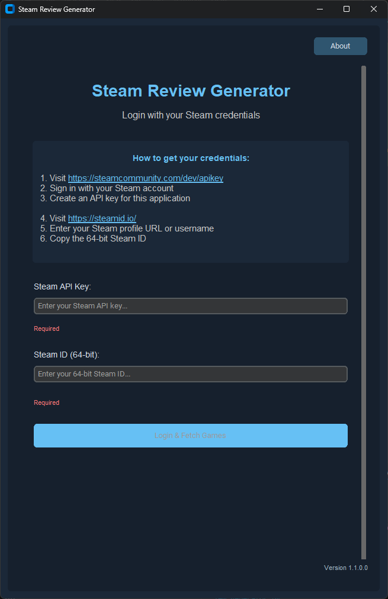
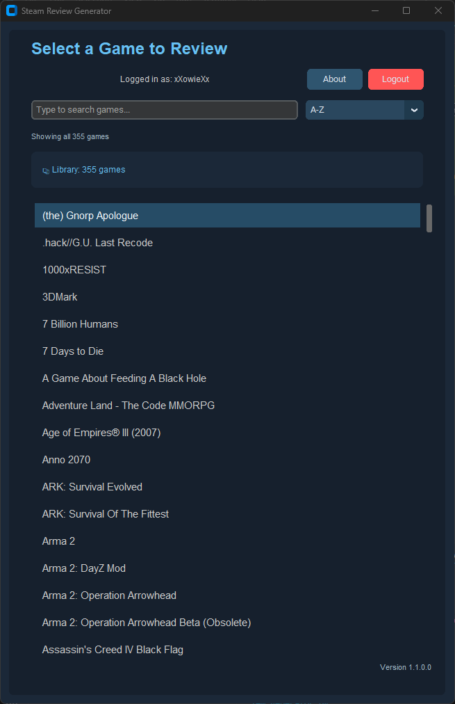

# Steam Review Generator


[](https://github.com/Xowie89/Steam-Review/releases/latest)

Steam Review Generator is a Steam-styled desktop app that turns your playtime into a polished review you can copy and share.

Pick a game from your owned library, rate guided categories step by step, and generate a final weighted score automatically.

## Product Showcase

| Login | Library |
| --- | --- |
|  |  |
| Sign in with Steam API key and SteamID64. | Search, sort, and select from your owned game library quickly. |

### Review Flow Demo

<video src="docs/screenshots/review-loading-to-ready.mp4" controls muted playsinline width="960"></video>

Loading and ready states in one pass: AI profile generation, status visibility, and start-review handoff.

[Open the MP4 directly](docs/screenshots/review-loading-to-ready.mp4)

## Highlights

- Steam login with API key + SteamID64
- Fast owned-games loading and search
- Summary screen with game details before rating
- Guided step-by-step review flow with Previous and Next controls
- Full-row click selection for each rating option
- Keyboard shortcuts while rating:
	- 1 through 9 selects scores 1 through 9
	- 0 selects 10 out of 10
	- Enter moves to the next step
- Final weighted score generation
- One-click clipboard copy
- Save output as .txt or .md
- Re-open and edit ratings from the result screen
- In-app version and update checking

## Requirements

- Windows
- Steam account
- Steam Web API key
- SteamID64
- Internet connection for Steam library loading

## Quick Start

1. Open the app.
2. Enter your Steam API key and SteamID64.
3. Load your library and choose a game.
4. Review the game summary screen.
5. Start rating categories.
6. Generate your final review.
7. Copy, edit, or save the output.

## Review Flow

- The app shows clear progress, such as Step 3 of 6.
- Next stays disabled until a rating is selected.
- Previous preserves earlier choices so you can revise quickly.
- If local AI assist is unavailable, the app automatically uses a built-in fallback profile.

## Sample Output

```text
Half-Life 2

━━━━━━━━━━━━━━━━━━━━━━━━━━━━━━━
PLAYTIME: 24 Hours
━━━━━━━━━━━━━━━━━━━━━━━━━━━━━━━

RATING BREAKDOWN:

• Core Gameplay: 10/10 - "Excellent"
• Design Quality: 9/10 - "Very Strong"
• Content Variety: 8/10 - "Strong"
• Progression and Pacing: 9/10 - "Very Strong"
• Technical Performance: 8/10 - "Strong"
• Audio and Presentation: 9/10 - "Very Strong"

━━━━━━━━━━━━━━━━━━━━━━━━━━━━━━━
★★★★★★★★★☆ 9/10
━━━━━━━━━━━━━━━━━━━━━━━━━━━━━━━

GitHub:
https://github.com/Xowie89/Steam-Review
```

## Troubleshooting

- Invalid API key:
	- Confirm you pasted the full key with no extra spaces.
	- Generate a new key and try again.
- No games found:
	- Verify the Steam profile and game details are public.
	- Confirm the SteamID64 is correct.
- Login timeout or network errors:
	- Check your internet connection.
	- Retry after a short delay if Steam services are under load.
- AI profile generation unavailable:
	- The app will continue with the fallback review profile.
	- If using local AI, verify Ollama is running and required models are installed.

## Security And Privacy

- Review text is generated locally in the app.
- Clipboard copy happens only when you click copy.
- SteamID and app state are stored in local app data for convenience.
- If keyring is available, the API key is stored in keyring.
- If keyring is not available, credentials fall back to local storage.
- Owned-games lists may be cached locally to speed up future loads.

## FAQ

### Where do I get a Steam API key?

Use the Steam Web API key registration page, create a key, then paste it into the app login screen.

### How do I find my SteamID64?

Open your Steam profile URL and copy the 64-bit numeric ID if shown, or use a SteamID lookup tool to convert your custom profile URL.

### Does this app require AI to work?

No. AI category assist is optional, and the built-in fallback profile always works.

### Can I edit ratings after generating a review?

Yes. Use the edit action on the result screen to jump back and adjust scores.

## Roadmap

- Improve diagnostics export for faster bug reports.
- Expand test coverage for AI profile validation and correction paths.
- Continue modularizing UI, API, and persistence layers.

## Support

- Use the About screen in the app for update and support links.
- Report bugs or request features here: https://github.com/Xowie89/Steam-Review/issues
